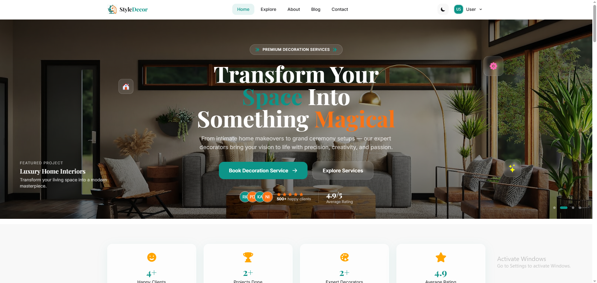
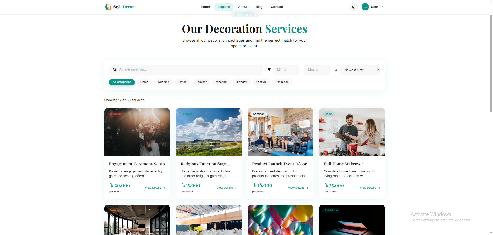
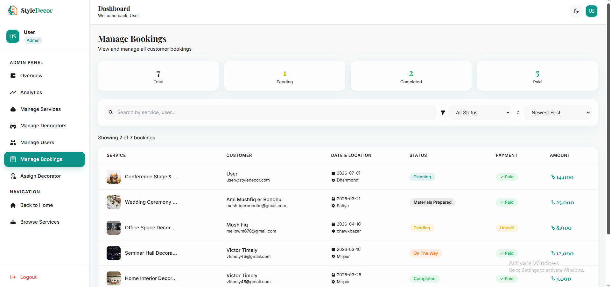
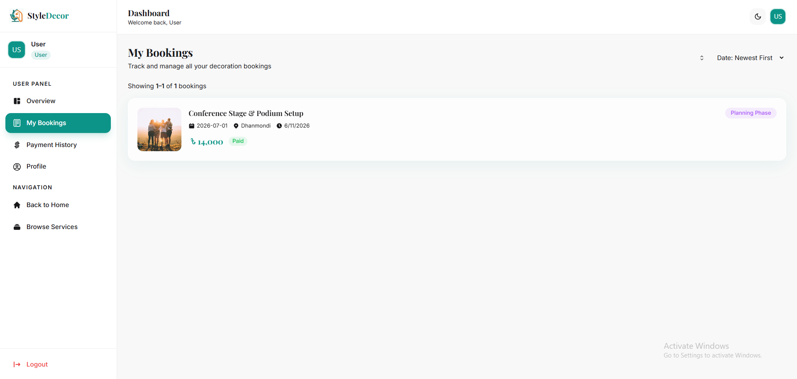

<div align="center">


</div>

<div align="center">

[](https://style-decor-client-five.vercel.app)
[](https://github.com/Mushfiq599/styledecor-client)
[](https://github.com/Mushfiq599/styledecor-server)
[](https://reactjs.org)
[](https://mongodb.com)

</div>

---

## 📌 Project Overview

**StyleDecor** is a full-stack decoration services booking platform where users can browse available decoration services, book appointments, and manage their bookings — while service providers and admins manage listings and oversee all bookings through a dedicated dashboard.

The platform is built with **React + Vite** on the frontend and a **Node.js/Express** REST API connected to **MongoDB** on the backend. It features **Firebase Authentication**, **ImageBB** file uploads for service images, paginated booking views, role-based access control, and is deployed across **Vercel** (frontend) and **Render** (backend).

---

## 🖼️ Screenshots

> **Home Page**


> **Services Page**


> **Booking Management (Admin)**


> **My Bookings (User)**


---

## ✨ Main Features

### 👤 User Features
- 🔐 Email/password and **Google OAuth** login via Firebase
- 🎨 Browse all available decoration services with search and filter
- 📅 Book a service by selecting date, location, and special requirements
- 📋 View personal bookings with status — pending, confirmed, cancelled
- ❌ Cancel a pending booking
- 👤 Update personal profile info

### 🛡️ Admin Features
- 📊 Admin dashboard with platform overview stats
- ➕ Add new decoration services with **ImageBB** image upload
- ✏️ Edit and delete existing services
- 📋 View **all bookings** across all users — paginated and sortable
- 🔄 Update booking status — confirm or cancel any booking
- 👥 View all registered users

### 🌐 General
- 🖼️ Service image uploads via **ImageBB API** — no local storage needed
- 📄 Paginated booking lists — smooth navigation through large data sets
- 🔒 JWT-secured API routes with HTTP-only cookies
- 📱 Fully responsive — mobile, tablet, and desktop
- ⚡ Fast client-side navigation with React Router DOM
- 🛡️ Protected routes — redirects unauthorized users correctly

---

## 🛠️ Tech Stack

### Frontend
| Technology | Purpose |
|---|---|
| React 18 | UI library |
| Vite | Build tool and dev server |
| React Router DOM | Client-side routing |
| Tailwind CSS | Styling and responsive design |
| Firebase Authentication | Email/password + Google OAuth |
| Axios | HTTP requests to backend API |
| React Hot Toast | Notification system |
| React Icons | Icon library |
| React Datepicker | Date selection for bookings |

### Backend
| Technology | Purpose |
|---|---|
| Node.js | Runtime environment |
| Express.js | REST API framework |
| MongoDB | Database |
| JSON Web Token (JWT) | Secure API authorization |
| Cookie-parser | HTTP-only cookie handling |
| Multer / ImageBB API | Image upload handling |
| CORS | Cross-origin resource sharing |
| dotenv | Environment variable management |

---

## 📦 Dependencies

### Frontend (`package.json`)
```json
{
  "dependencies": {
    "react": "^18.3.1",
    "react-dom": "^18.3.1",
    "react-router-dom": "^6.24.0",
    "firebase": "^10.12.0",
    "axios": "^1.7.2",
    "react-hot-toast": "^2.4.1",
    "react-icons": "^5.2.1",
    "react-datepicker": "^7.3.0",
    "tailwindcss": "^3.4.4"
  },
  "devDependencies": {
    "vite": "^5.3.1",
    "@vitejs/plugin-react": "^4.3.1"
  }
}
```

### Backend (`package.json`)
```json
{
  "dependencies": {
    "express": "^4.19.2",
    "mongodb": "^6.7.0",
    "jsonwebtoken": "^9.0.2",
    "cookie-parser": "^1.4.6",
    "multer": "^1.4.5-lts.1",
    "cors": "^2.8.5",
    "dotenv": "^16.4.5",
    "axios": "^1.7.2"
  }
}
```

---

## ⚙️ Local Setup Guide

### Prerequisites
- Node.js v18+ installed
- MongoDB Atlas account (or local MongoDB)
- Firebase project created
- ImageBB account (free) for image uploads
- Git installed

---

### 1. Clone the repositories

```bash
# Clone frontend
git clone https://github.com/YOUR_USERNAME/styledecor-client.git
cd styledecor-client

# Clone backend (open a second terminal)
git clone https://github.com/YOUR_USERNAME/styledecor-server.git
cd styledecor-server
```

---

### 2. Backend setup

```bash
cd styledecor-server
npm install
```

Create a `.env` file in the backend root:

```env
PORT=5000
DB_USER=your_mongodb_username
DB_PASS=your_mongodb_password
ACCESS_TOKEN_SECRET=your_jwt_secret_key
IMAGEBB_API_KEY=your_imagebb_api_key
```

Start the backend server:

```bash
node index.js
```

Backend will run at: `http://localhost:5000`

---

### 3. Frontend setup

```bash
cd styledecor-client
npm install
```

Create a `.env` file in the frontend root:

```env
VITE_API_URL=http://localhost:5000
VITE_FIREBASE_API_KEY=your_firebase_api_key
VITE_FIREBASE_AUTH_DOMAIN=your_project.firebaseapp.com
VITE_FIREBASE_PROJECT_ID=your_project_id
VITE_FIREBASE_STORAGE_BUCKET=your_project.appspot.com
VITE_FIREBASE_MESSAGING_SENDER_ID=your_sender_id
VITE_FIREBASE_APP_ID=your_app_id
VITE_IMAGEBB_API_KEY=your_imagebb_api_key
```

> ⚠️ **Note:** Vite uses `VITE_` prefix instead of `NEXT_PUBLIC_` for environment variables.

Start the frontend:

```bash
npm run dev
```

Frontend will run at: `http://localhost:5173`

---

### 4. Get your ImageBB API key

1. Go to [imgbb.com](https://imgbb.com) and create a free account
2. Visit [api.imgbb.com](https://api.imgbb.com) to get your API key
3. Paste it into both `.env` files above

---

### 5. Demo credentials (for testing)

| Role | Email | Password |
|---|---|---|
| Admin | admin@styledecor.com | Admin@123 |
| User | user@styledecor.com | User@123 |

*(Update these with your actual demo credentials)*

---

## 🌐 Live Link & Relevant Links

| Resource | Link |
|---|---|
| 🌐 Live Site | [style-decor-client-five.vercel.app/](https://style-decor-client-five.vercel.app/) |
| 💻 Frontend Repo | [github.com/Mushfiq599/styledecor-client](https://github.com/Mushfiq599/styledecor-client) |
| ⚙️ Backend Repo | [github.com/Mushfiq599/styledecor-server](https://github.com/Mushfiq599/styledecor-server) |
| 🖼️ ImageBB API | [api.imgbb.com](https://api.imgbb.com) |
| 🔥 Firebase Console | [firebase.google.com](https://firebase.google.com) |
| 🍃 MongoDB Atlas | [mongodb.com/atlas](https://mongodb.com/atlas) |
| ☁️ Render (Backend) | [render.com](https://render.com) |

---

<div align="center">


</div>
